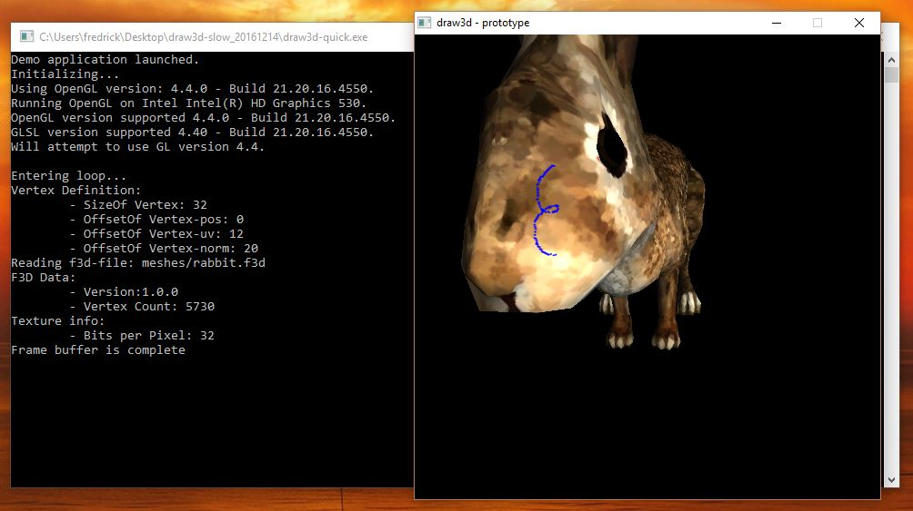
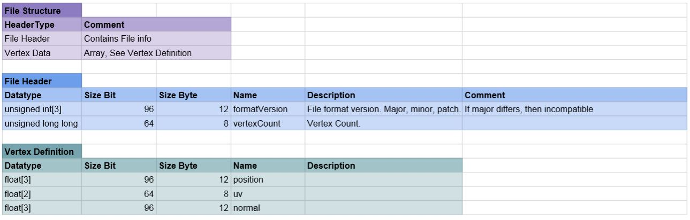

# Draw3D Demo

A demo of screen-space picking, 3D-rendering and serialization as well as deserialization.

  - Arrow keys and w, a, s, d, q, e controls zoom and rotation in object-space.
  - mouse buttons click and drag as well as scrolling controls the same.

This was created as a test of my theories of screen-space picking and drawing to texture.

### Tech

The solution was developed and tested with the following tech and their respective versions:

* [C++ 11][cpp11] - Programming language
* [SDL 2][sdl2] - Cross-platform multimedia library
* [OpenGL 4.3][opengl43] - Rendering library
* [GLSL 4.3][glsl43] - Shading language
* [GLM][glm] - Math library
* [Python 3.5.2][py352] - Programming language
* [Blender 2.82][blend282] - Mainly a 3D-suite

### Custom binary format

The application includes a simple exporter script for blender that export a given mesh to a file.
The main application then reads this kind of file and creates a 3d object at origo.

Simple binary file format that contains mesh information.

### Todos

 - Optimize draw (click-drag).
  - The current implementation is CPU-heavy and this could be partially implemented on the GPU via GLSL.
 - Implement different draw modes.
  - Older version used a "dotting"-approach to drawing, latest version draws a line in a very non-optimized manor.

License
----

[LGPL 3.0](./LICENSE)

[//]: # (These are reference links used in the body of this note and get stripped out when the markdown processor does its job. There is no need to format nicely because it shouldn't be seen. Thanks SO - http://stackoverflow.com/questions/4823468/store-comments-in-markdown-syntax)

   [cpp11]: <http://www.stroustrup.com/C++11FAQ.html>
   [sdl2]: <https://www.libsdl.org/>
   [opengl43]: <https://www.opengl.org/>
   [glsl43]: <https://www.khronos.org/opengl/wiki/OpenGL_Shading_Language>
   [glm]: <http://glm.g-truc.net/0.9.8/index.html>
   [py352]: <https://www.python.org/>
   [blend282]: <https://www.blender.org/>
